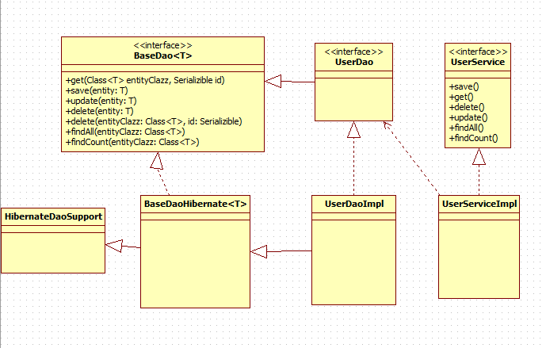

# Learn SpringBoot #2

##### 13th Dec. 2017

keywords: spring java SOAP DAO JPA XML namespace

### SOAP (Simple Object Access Protocol)

Reading list: 
[Intro & Definition on W3C](https://www.w3.org/TR/soap/), 
[The actual description(v1.1)](http://schemas.xmlsoap.org/soap/envelope/), 
[Someone else wrote an intro](http://blog.csdn.net/bestlove12345/article/details/51849568).

More basic knowledge about XML: 
[XML namespace](http://blog.csdn.net/tjbsl/article/details/50457514), 
[and an easier one](http://blog.csdn.net/w938706428/article/details/41448821)

### DAO (Data Access Object)

Dao is used to manipulate database. 

As shown in the example below, we can have a baseDao that realizes most basic functions including add/delete/update/get. Some other Dao can extend(?) the baseDao for more complex model.

[More about implementation of DAO pattern](https://www.cnblogs.com/guoyansi19900907/p/4405013.html)

### JPA (Java Persistence API)

JPA is just an interface without implementation. It defines that how to implement an ORM (Object-Relational Mapping). Hibernate is one of the JPA implementation. But Hibernate has its own annotations, if you follow Hibernate one, than you are not able to switch to other implementations. 

My wording can be a bit confusing.. I'll just left my reading list here:
[Intro of JPA implementation(Stackoverflow)](https://stackoverflow.com/questions/4477082/what-is-a-jpa-implementation), 
[Difference between JPA and Hibernate?(Stackoverflow)](https://stackoverflow.com/questions/9881611/whats-the-difference-between-jpa-and-hibernate?noredirect=1&lq=1)

##### 14th Dec. 2017
### Spring Data JPA

Read first: [SpringBoot Docs](https://docs.spring.io/spring-boot/docs/1.5.9.RELEASE/reference/htmlsingle/#boot-features-jpa-and-spring-data)

### Spring Bean

Read first: 
[Spring framework docs #Core Container](https://docs.spring.io/spring/docs/4.3.13.RELEASE/spring-framework-reference/htmlsingle/#overview-core-container), 
[#Spring Bean Intro](https://docs.spring.io/spring/docs/4.3.13.RELEASE/spring-framework-reference/htmlsingle/#beans-introduction).

### Digression

+ NodeJS vs Spring+Tomcat etc. (Java related server): [link](https://www.zhihu.com/question/21667825)

